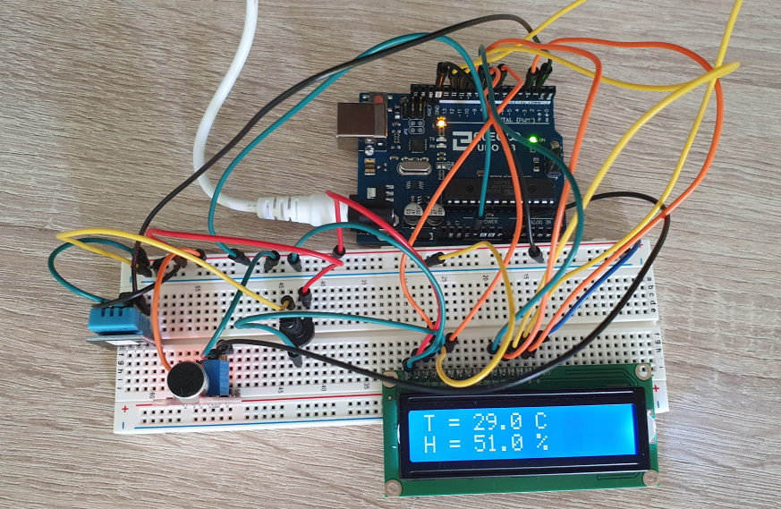
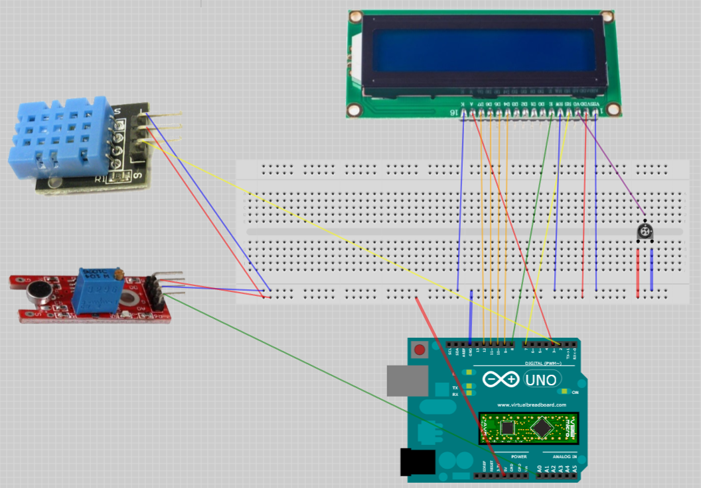

# Aduino-Meteo-Sensor

Simple Arduino project of a meteo sensor displaying current temperature and humidity values.
The display remains in the sleep until it is waked up from a clap.
The project is based on ELEGOO tutorials: https://www.elegoo.com/pages/arduino-kits-support-files

### Equipment
* Elegoo UNO R3 - x1
* LCD 1602 Module - x1
* DHT 11 Temperature and Humidity Module - x1
* Potentiometer (10K) - x1
* KY-038 Sound Sensor Module - x1
* 830 Tie-Points Breadboard - x1
* Wires - x22
* USB Cable - x1

### Circuit Diagram

### Tools
* Arduino Studio 1.8.12

### Optional
* Virtual Breadboard 1.5.0 - to open and modify the circuit diagram

### Flash
* Connect the microcontroller via USB
* Open src/arduino-meteo-sensor/arduino-meteo-sensor.ino in Arduino Studio
* Go to Sketch -> Include Library -> Use ZIP Library...
* Select src/DHT.zip and src/LiquidCrystal.zip libraries
* Compile and flash the sketch